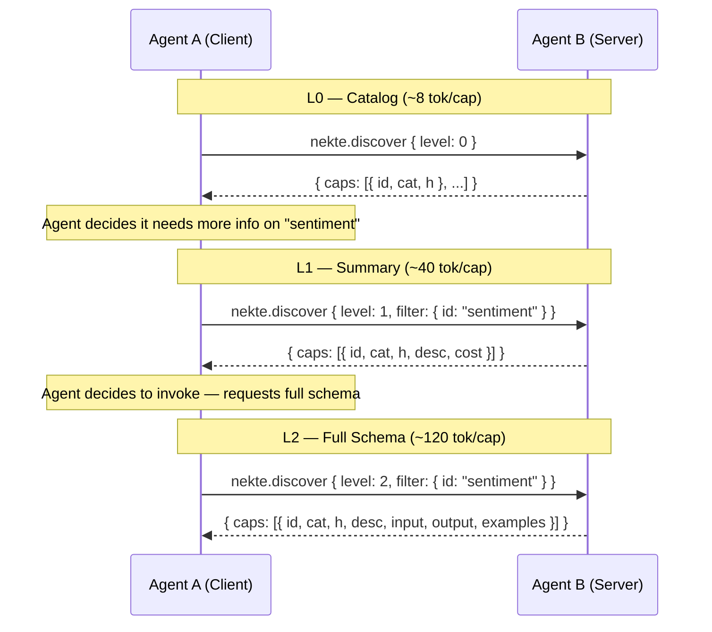
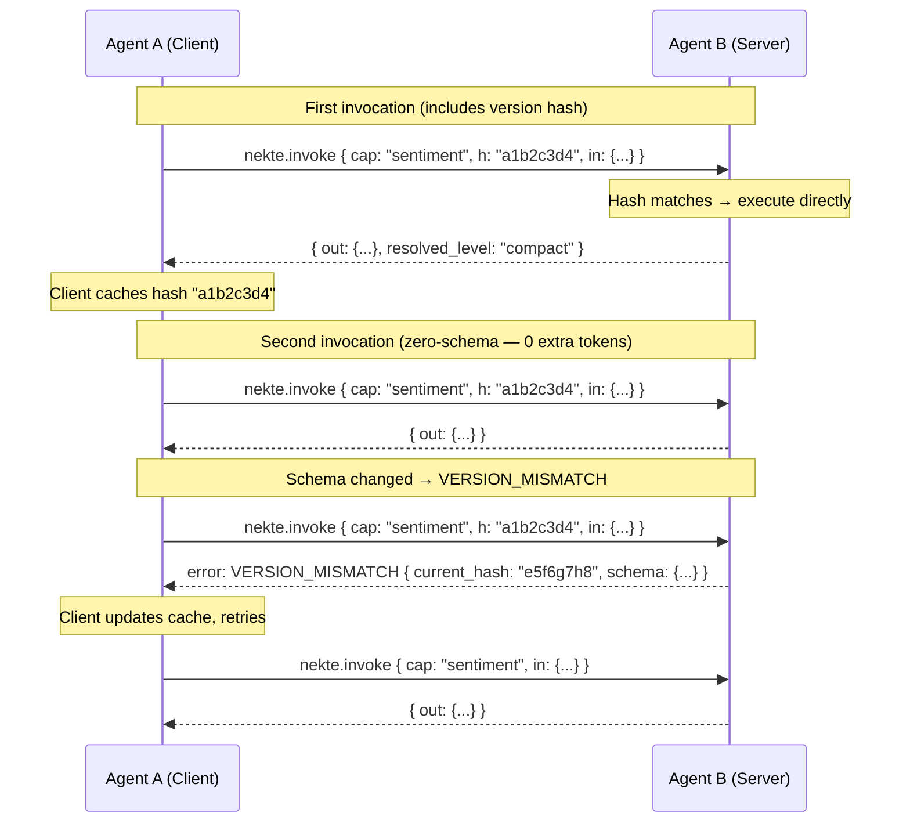
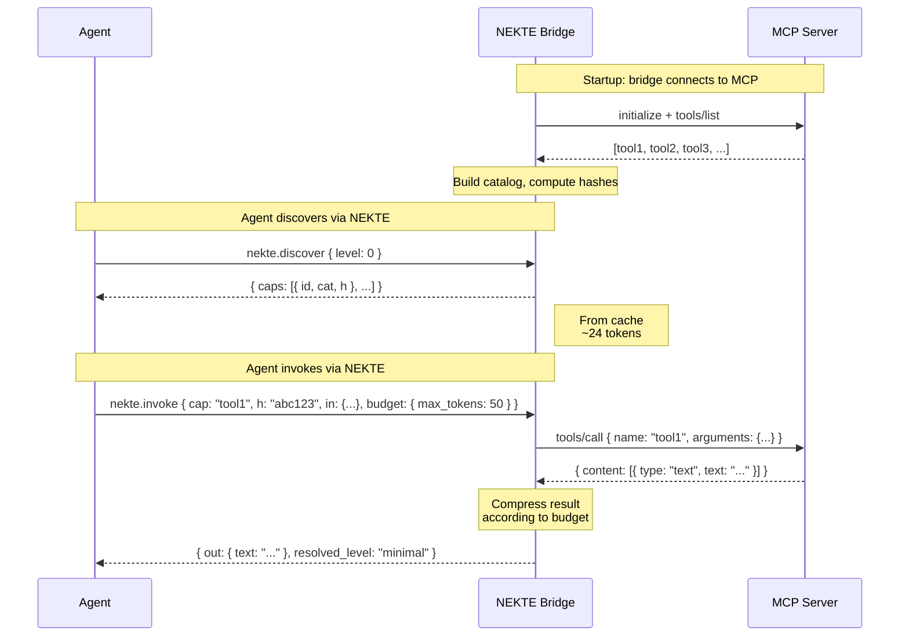
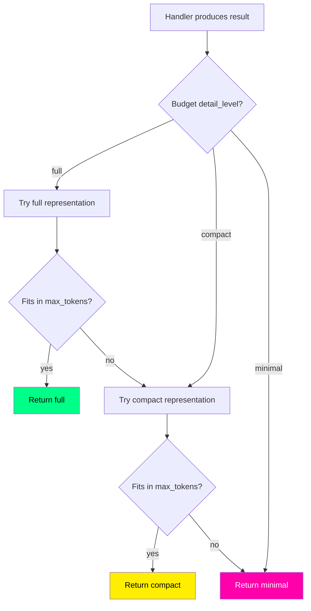
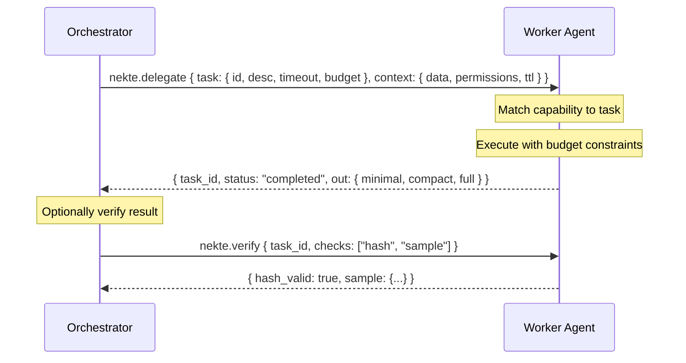
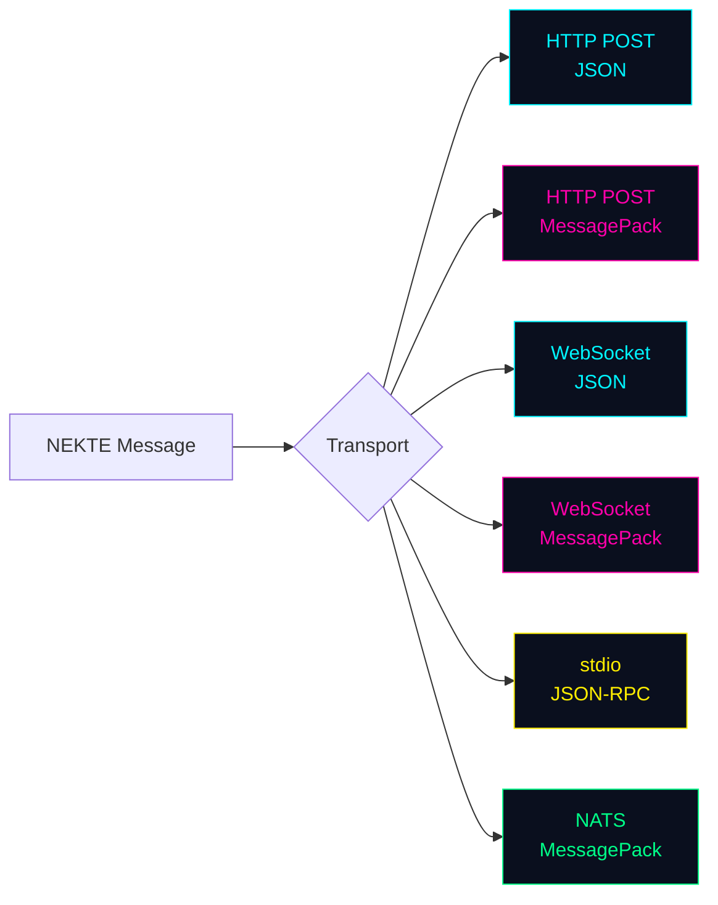

# NEKTE Protocol Flows

Visual diagrams of the core protocol interactions.

## 1. Progressive Discovery (L0 → L1 → L2)

## 2. Zero-Schema Invocation

## 3. MCP Bridge Flow

## 4. Token Budget Resolution

## 5. Task Delegation

## 6. Wire Format Options

